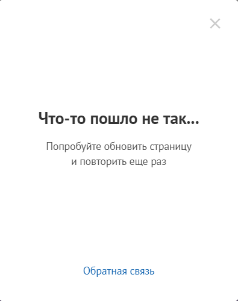
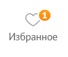

# Lab_3 (25.09.2023)
## Test-cases (интернет-магазин [DNS.ru](https://www.dns-shop.ru))

<strong>KNI_1_lb3</strong>. Регистрация. 
<strong>Краткое описание:</strong> проверка корректности
регистрации на сайте 
<strong>Предусловие (входные данные):</strong> Для выполнения этого теста
мы предварительно зайдём в панель авторизации/регистрации.
Будем использовать следующие входные данные: 
<i>Адрес электронной почты: nikitakorshun@mail.ru</i> 
<strong>Шаги:</strong> 

1. Ввести свой адрес электронной почты
2. Нажать на кнопку "Получить код"
3. Получить код на почту
4. Ввести в качестве подтверждения 6-и значный код из письма

<strong>Ожидаемый результат:</strong> Пользователь успешно прошел регистрацию 
<strong>Фактические результаты: </strong> Надпись "Что-то пошло не так...", но после 
обновления страницы, вход в аккаунт, а, соответственно, и регистрация были выполнены
успешно! 
 
<strong>Статус: </strong> тест пройден частично 

<strong>KNI_2_lb3</strong>. Добавление товара в избранное. 
<strong>Краткое описание:</strong> проверка корректности
добавления товаров в панель "Избранные товары" 
<strong>Предусловие (входные данные):</strong> для того, чтобы у пользователя были сохранены
все товары в избранном, он должен быть
зарегистрирован и авторизован в личном кабинете. 
<strong>Шаги:</strong> 

1. Зайти на сайт [DNS.ru](https://www.dns-shop.ru)
2. Посредством поиска и/или панели "каталог" найти необходимые товары 
3. Выбрать необходимый товар
4. Открыть страницу товара (можно и не открывать)
5. Нажать на значок "сердечко" 

<strong>Ожидаемый результат:</strong> товар добавился в панель "Избранное",
в верхней навигационной панели появился символ "+1"
возле соответствующего пункта меню. При переходе в него, там будет находится выбранный 
нами товар: 
 
<strong>Фактические результаты: </strong> как ожидали 
<strong>Статус: </strong> пройден успешно 
